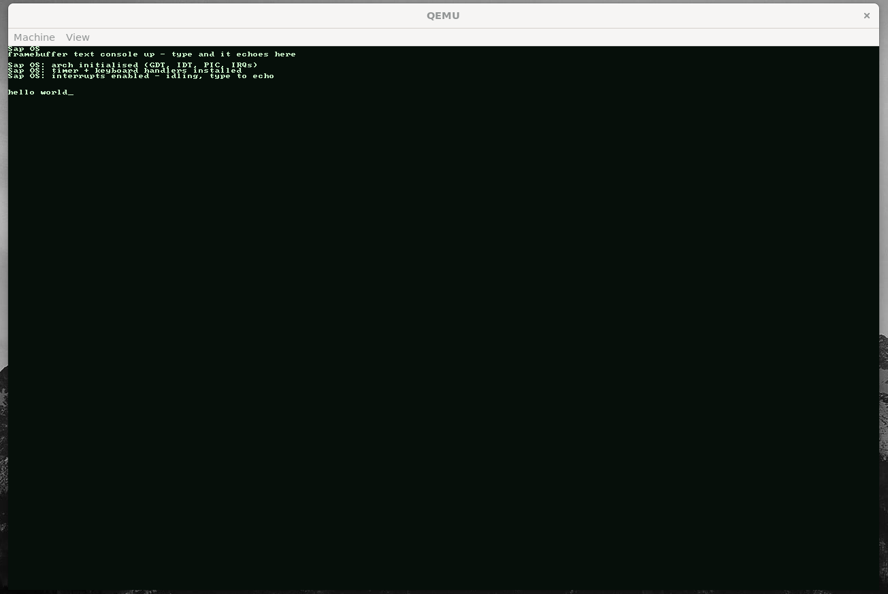

<div align="center">

# Scrap OS

A custom x86_64 operating system, written from scratch in C.
Under heavy development. No releases will be made for a while.

<p>
  
  
  
</p>

Not based on Linux. Its own thing, built phase by phase as a learning project.

<br>



</div>

---

## What it is

ScrapOS is a from scratch x86_64 monolithic kernel written in C. It boots on its own page tables, manages its own memory, handles interrupts, and renders text to its own framebuffer console. No Linux underneath. Every subsystem is built, broken, and understood one phase at a time.

## Status

**Phase 0** — Boots via Limine, framebuffer and serial output

**Phase 1** — GDT, IDT, CPU exception handlers, PIC remap

**Phase 2** — PIT timer and PS/2 keyboard, live interrupt handling

## It's actually becoming a computer

ScrapOS now boots on its own page tables and manages memory through a full four layer allocator: physical frames, paging, a buddy allocator, and a slab allocator with `kmalloc` and `kfree`. It handles timer and keyboard interrupts and renders text to its own framebuffer console. You can type into it and watch characters appear on screen, with backspace and scrolling working.

Four phases of low level systems work, all written from scratch in C.

## Building

Developed on WSL2 (Ubuntu). Needs `clang`, `lld`, `nasm`, `xorriso`, `qemu`, `make`.

```bash
make        # build the bootable ISO
make run    # boot it in QEMU
```

See [docs/ARCHITECTURE.md](docs/ARCHITECTURE.md) for the design.

## Notes

ScrapOS is built with AI assistance (Claude) used as a learning tool. The original goal was to improve my knowledge of systems and low level programming. Every subsystem is reviewed, debugged, and understood rather than blindly generated. The AI plans and pair programs, leaving me to drive, test, and learn how each piece actually works.

There's no point trying to claim credit for this. It's here to learn and understand.

## License

MIT. See [LICENSE](LICENSE).
